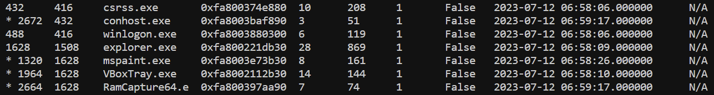
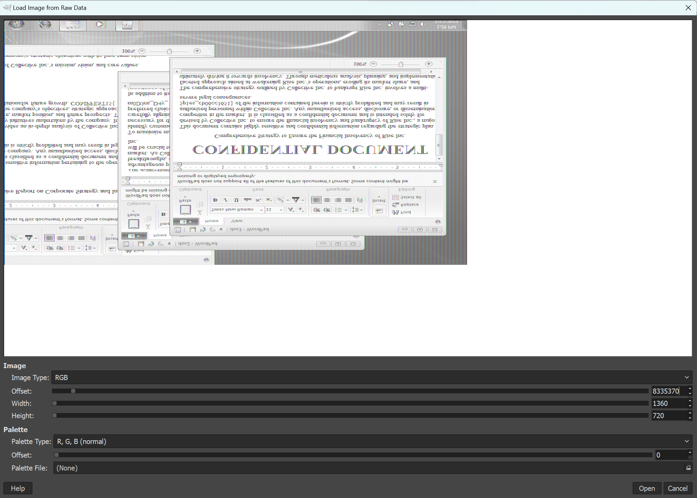
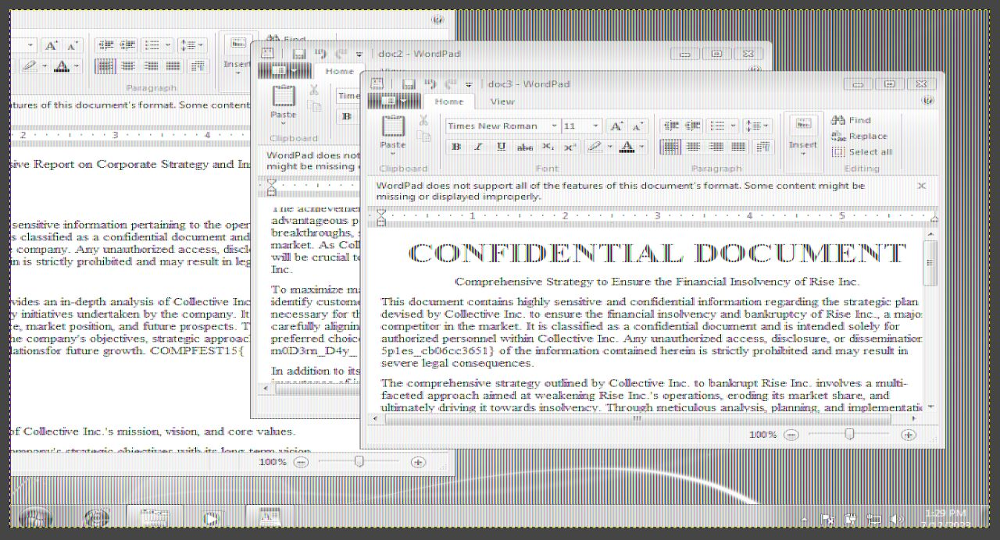

# Writeup industrialspy

Cek process apa saja yang sedang dibuka saat capture
```bash
python3 volatility3/vol.py -f lyubov_20230712.mem windows.pstree
```



Kita akan dump process MS Paint
```bash
python3 volatility3/vol.py -f lyubov_20230712.mem windows.memmap --dump --pid 1320
```

Hasil dumpnya kita akan buka di GIMP (ganti extension menjadi .data)
dan ubah-ubah offset, width dan height agar gambar terlihat.

