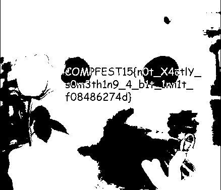

# Writeup not simply corrupted

Image is a 4-bit obfuscated PNG. Notice that the first 16 bytes of the `cat.png` resembles a JPG header:

`10 00 10 01 01 01 00 00 01 00 11 10 01 00 01 11`

becomes:

`1000 1001 0101 0000 0100 1110 0100 0111`

in hex, becomes:

`89 50 4E 47`

Scripting is needed to convert back the image to a functional png. The following script which writes the output file to `chall.png` can be used:

```python
from binascii import *
from re import *

masuk = open("cat.png", 'rb')
masuk_hex = []
output = open("chall.png", 'wb')

for i in masuk.read():
    masuk_hex.append(f"{i:02x}")

masuk_hex = [ ''.join(x) for x in zip(masuk_hex[0::4], masuk_hex[1::4], masuk_hex[2::4], masuk_hex[3::4]) ] 
for i in masuk_hex:
    hexx = hex(int(i, 2))
    hexx = hexx[2:]
    if len(hexx) % 2 == 1:
        hexx = '0' + hexx
    output.write(unhexlify(hexx))
```

After the conversion, we were given the cat meme with the text "sir can i habe flag pls".


Nothing suspicious at first glance, but if you use tools such as stegsolve or AperiSolve to perform LSB steganography, you can see there's a hidden message in the LSB of the red bits.



